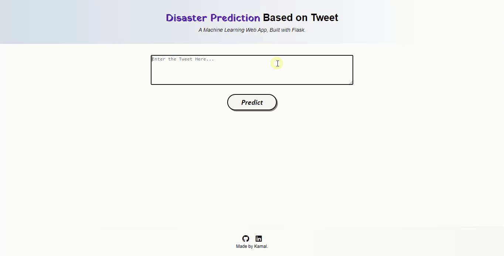

# Disaster-Tweet-Prediction
<b> Predict which Tweets are about <i>real disasters</i> and which ones are <i>not</i>.</b>

• This repository consists of files required to deploy a Machine Learning Web App created with Flask on Heroku platform.

• Please find the below link of the deployed model in Heroku App: 
_https://disaster-tweet.herokuapp.com/_

• A small GIF about the web app:

